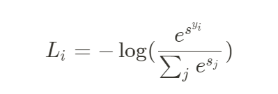
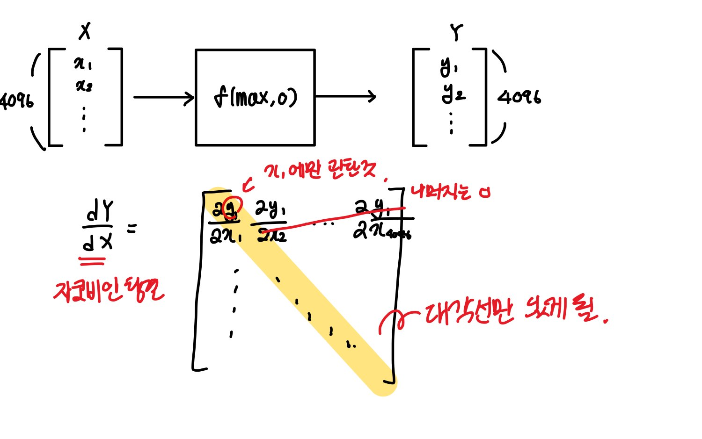

# 스터디 2주차

- [Lecture 3](#-lecture-3)
- [Lecture 4](#-lecture-4)

## Lecture 3

#### ✅ `혜지` `p7` ‘행렬 W의 각 행들이 해당하는 그 클래스의 템플릿이 된다’ 는 말이 이해가 안감

저번에 설명했듯이 W라는 가중치 행렬의 각 행의 요소 하나하나가 "한 pixel이 해당 클래스(ex. 고양이)에 얼마나 큰 영향을 주는가"를 의미한다. 그래서 이 모든 pixel에 대한 것이 각 행이며 이걸 입력 이미지와 내적했을 때 값이 크면 "해당 클래스일 확률이 높은 것"이다.

#### ✅ `소현` `p17` Loss Function에서 safety margin을 1로 설정을 했는데 이를 설정한 이유를 설명하면서 “스코어의 숫자보다는 스코어 간의 차이에 더 집중한다. 이 1은 W의 스케일에 의해 상쇄된다.”고 했는데 여기서 W의 스케일이 뭔지 궁금합니다.

스케일을 하든 말든 어짜피 스코어 간의 차이가 중요하므로 크게 중요하지 않다는 말 아닐까 싶다.

다음 주까지 찾아오기

#### ✅ `세연` `21:30` `p20` 왜냐면 Loss를 계산할때 정답이 아닌 클래스를 순회합니다. 그러면 C - 1 클래스를 순회하겠죠. 비교하는 두 스코어가 거의 비슷하니 Margin때문에 우리는 1 스코어를 얻게 될 것입니다. 그리고 전에 Loss는 C - 1을 얻게 되는 것이죠” 라는 부분이 잘 이해가 안됩니다.

이렇게 되어 있는데 s가 모두 0 (사실은 아주 작은 값)이라고 가정을 하면 0-0+1이 되어 1이 나오고 이것은 0보다 크니 1이 나오게 됩니다. 근데 조건에 정답 클래스에 해당하는 건 제외가 되니 (클래스 개수 - 1)이 되는 것입니다.

#### ✅ `재용` `31:47` `p34` L1은 희소행렬을 만드는 이유?

[Why L1 norm for sparse models](https://stats.stackexchange.com/questions/45643/why-l1-norm-for-sparse-models)

`L1` 이 어떻게 생겼는지를 생각해보면 직관적으로 이해할 수 있다. `L1` 은 가중치 요소들의 절대값의 합이다. 그럼 `L1` 규제를 했을 때 이 `L1` Norm이 가장 작아지려면 어때야할까? 값을 작게 하는 것도 좋지만 0이 많아지는 게 `L1` Norm을 작게 할 것이다. 그러므로 `L1` 을 규제로 쓰면은 해당 모델은 W의 0이 많아지도록 학습하게 된다.

#### ✅ `소현` `p35` 여기 예시를 이용해서 L1과 L2 규제에 대해서 이해를 해봤는데.. 이렇게 이해하는게 맞는지궁금합니다. 우선 L1의 경우 W에 대한 L1 Norm을 규제로 쓰는 것인데 기존 Loss Function을 제쳐두고 L1 규제를 작게 하기 위해서는 벡터의 대부분의 요소들이 0인 것이 좋다고 생각했습니다. 왜냐하면 L1 Norm은 W의 절대값들의 합이므로 최대한 절대값이 적게 하도록 0이 되도록 학습하기 때문입니다. 반대로 L2의 경우 W의 제곱들의 합이므로 이를 작게 하기 위해서는 작은 값들이 분산이 되어 있는 경우가 제일 작다고 생각했습니다. 그래서 W가 덜 매끄럽다(값이 튄다)는 것이 모델의 복잡도를 나타낸다고 이해했습니다. 맞나요?

#### ✅ `재용` `35:50` `p36` L1, L2는 각각 어떤 데이터에 알맞지?

L1의 경우 희소행렬로 만들기 때문에 큰 값을 갖지 않는 피처들을 0으로 만든다. 그러므로 피처가 중요한 피처들만 뽑아서 학습을 하고 싶은 경우 `L1` 을 사용하고 딱히 특징이 없는 경우 즉 특히나 중요한 피처가 없는 경우 `L2` 를 사용한다.

#### ✅ `세연` `40:50` `p41` softmax와 두 분포 간의 KL divergence, MLE? 비슷한 방식인 이유?

이 말인 것 같다. softmax로 확률 분포를 구하고 이걸로 어떻게 "정답클래스에 해당하는 클래스 확률이 1에 가깝게 하지"라는 질문을 `negative log likelihood` 로 풀 수도 있고 `KL Divergence` 로 풀 수도 있고 `MLE` 로도 풀 수 있다는 말인 것 같음.

근데 뭐 그거말구 그냥 `negative log likelihood` 를 쓴다는 말인 듯.

#### ✅ `혜지` `p48` 왜 log(C )인지 모르겠음

#### ✅ `소현` `p48` 왜 W의 초기값이 매우 작고 score 값들이 0에 가까울 대 Loss가 logC인지 궁금합니다. 학생 중 대답으로 -log(1/C)도 있었는데 그것도 어떻게 유도된 건지 궁금합니다.

이 식을 일단 보면 s값이 다 0이라고 가정하면 L값은 -log(1/(클래스의개수))가 된다. 이걸 풀면 -log1-(-log클래스의개수)가 되므로 정리하면 logC가 된다.

#### ✅ `혜지` `p60` 유닛벡터와 gradient 벡터 내적이 무슨 말일까…

gradient 벡터는 기울기의 정도를 의미하고 방향의 unit벡터는 어느 쪽을 가리키는 지에 대한 벡터여서 아닐까? 3차원에 해당.

#### ✅ `소현` `p72` Numerical Gradient를 구현해서 체크해보는 것이 디버깅할 때 좋은 이유(?)를 생각해봤는데 내가 구현한 back propagation 알고리즘이 잘 구현이 되었는지 단순 확인 하기 위한 방법인가로 이해했는데 맞나요?

그런 것 같습니다. 근데 다음 질문과 이어집니다.

 

## Lecture 4

#### ✅ `소현` `p7` 수치적 미분의 장단점은 다 이해가 되는데 해석적 미분에서 error-prone 부분이 왜 그런지 모르겠습니다. error-prone을 찾아보니 “에러가 발생하기 쉬운”이라는데 왜 그런지 궁금합니다. 오히려 근사적 수치로 미분을 구한 수치적 미분보다 더 정확할 거라 생각하는데 이 부분이 왜 그런지 궁금합니다.

계산할 때 실수하기 쉽다. 손으로 계산을 해야하니까. 계산할 때 실수하기 쉽다. 수치적 미분으로 검산을 한다.

#### ✅ `혜지` `p57` 자코비언 행렬은 대각행렬이 된다는 게 무슨 말?

#### ✅ `소현` `p57` 왜 자코비안 행렬이 대각행렬이 되는지가 궁금합니다. 설명으로는 요소별 연산을 해서 그렇다는 식이었데 이해가 가질 않습니다.

이게 자코비안 행렬인데 다변수 벡터 함수의 도함수 행렬이다. 벡터에 벡터를 나눠준 미분 값들을 모아놓은 행렬이라 보면 된다.

PPT로 다시 돌아가서 보면 저 f에 해당하는 것이 "(4096, )인 출력"이고 x에 대항하는 것이 "(4096, )인 입력"이다. 그럼 각 출력에 대해 각 입력에 대한 미분 값을 행렬로 만들면 `4096*4096` 인 자코비안 행렬이 나타난다. 이 때 출력을 만들이 위해 `max(0, x)` 를 해주었다.

max의 역전파는 자기가 max로 나올 경우 1이 국소적 미분값이고 아닐 경우 0이다. 그러므로 자코비안으로 나타내보자. f_1 = 첫 번재 요소의 max 결과일 것이다. 그걸 각 x_1, x_2, x_3, ... 에 대해 미분을 해보면 x_1은 1(0보다 작으면 0이겠지만은)이고, 나머지는 해당이 없으니 0이 될 것이다.

그러므로 자코비안 행렬은 대각행렬이 되는 것이다.

#### ✅ `재용` `47:03` `p70` W gradient matrix가 transpose 되어있는 것?

강의참고.

#### ✅ `혜지` `p86` h는 max 함수 ?

맞다. h는 활성화 함수를 말한다. W1\*x를 한 다음에 활성화 함수를 거쳧서 그 다음 W2인 layer에 전달한다.
